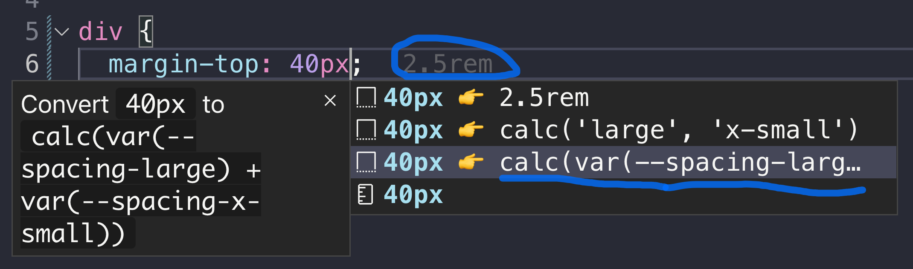
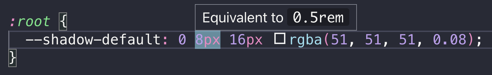
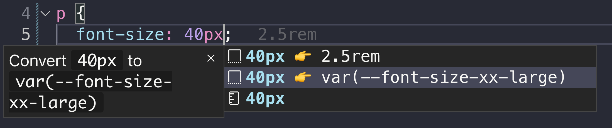

## Code Editor Extensions

### The Visual Studio Code Extension

It supports:

- plain `px` to `rem` conversion.
- annotation for `px` and `rem` equivalent values.
- auto completion for the [spacing system](/uilib/usage/layout/spacing/).
- auto completion for [`font-size`](/uilib/typography/font-size/) and [`line-height`](/uilib/typography/line-height/).

Install the [VSCode Extension](https://marketplace.visualstudio.com/items?itemName=dnbexperience.vscode-eufemia) or view the
[source code](https://github.com/dnbexperience/vscode-eufemia).

#### Screenshots

1. Spacing System example

2. Equivalent to `px` or `rem` value example

3. `font-size` example

## ESLint Plugin

You may have a look at the [Eufemia ESLint Plugin](https://github.com/dnbexperience/eslint-plugin-eufemia) it will over time extend with more rules that can help you detect issues or recommendations.
