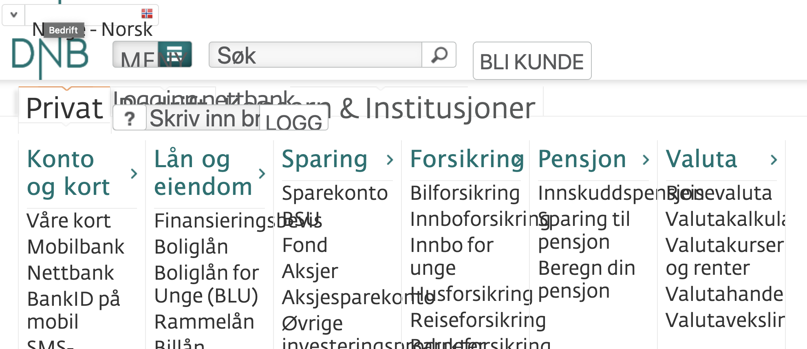

<Intro>

# Accessibility

User Experience (**UX**) is much more than only the visual part. It for sure have to include good accessibility so all people can use our applications, services and solutions.

You have to:

- test **keyboard navigation** during development
- test with **screen readers** during development
- test with **200%** in `font-size` during development

You may read more about [these targets](!/uilib/usage/accessibility).

## Tools

Eufemia includes a range of tools to help you make better accessible applications:

- [Focus Management](!/uilib/usage/accessibility/focus)
- [Accessibility Checklist](!/uilib/usage/accessibility/checklist#accessibility-checklist)
- [Skip Link](!/uilib/usage/accessibility/focus#skip-link)
- [Semantics example](!/uilib/usage/accessibility/checklist#landmark--and-semantics-example)

## Components

- [Number](!/uilib/components/number) makes numbers accessible for screen readers.
- [Heading](!/uilib/components/heading) handles heading leveling automatically.
- [GlobalStatus](!/uilib/components/global-status) includes grouping of form status messages and live announcements for screen readers.
- [FormRow](!/uilib/components/form-row) includes `<fieldset>` and `<legend>`.

All form components includes a `label` property to bind automatically the FormLabel to the components (HTML element).

```jsx
<Input label="Input label:" />
```

And all form components includes the [FormStatus](!/uilib/components/form-status) component which is coupled to the component by using `aria-describedby`.

```jsx
<Input status="Status message:" />
```

### **200%** you said?

---



---

<IntroFooter href="/uilib/intro/04-ux-handover" text="Next - UX handover" />

</Intro>
