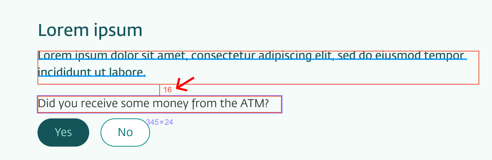
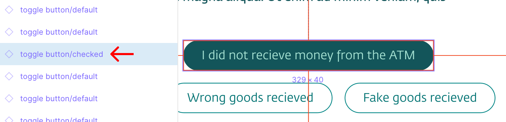
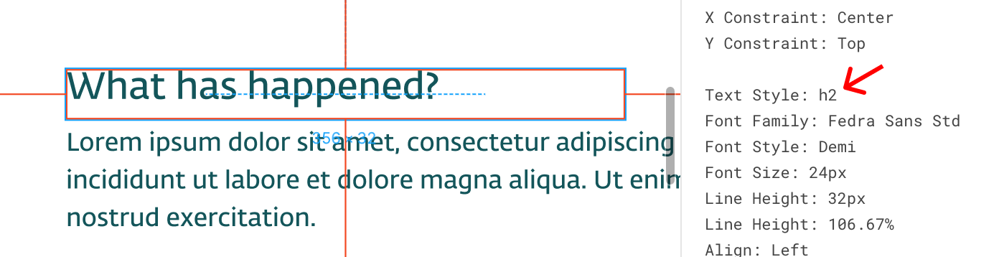
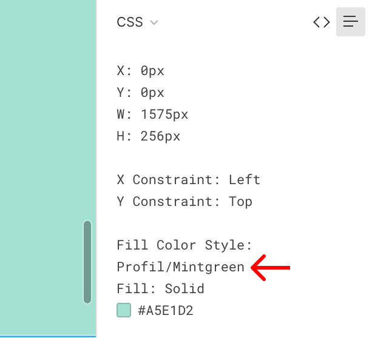

<Intro>

# UX handover

UX Designers at DNB are using Figma. Figma files can be shared and viewed online.

To get the details and properties about the layout, styles and the used components, you can inspect the file both for colors, typography, spacing and component usage.

## Spacing

Remember, everything should be in the **8px grid** (0.5rem) spacing - even it the designer sometimes are one or two pixels of, you now know what it should be.

1. Select an area by a single _click_.
2. _Hover_ on the next areas to se the spacing between them.

## Components

1. Select a component by a single _click_.
2. Have a look at the _Pages_ pane on the left side.

## Typography

1. Select a text by a single _click_.
2. Have a look at the _Properties_ pane on the right side.

## Color

1. Select an area by a single _click_.
2. Have a look at the _Properties_ pane on the right side. Only use the color name as the reference. Do not copy HEX codes.

<IntroFooter href="/uilib/intro/05-eufemia-for-developers" text="Next - Eufemia for Developers" />

</Intro>
