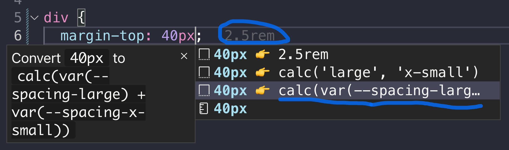
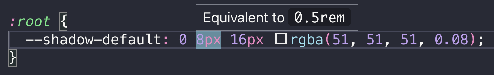
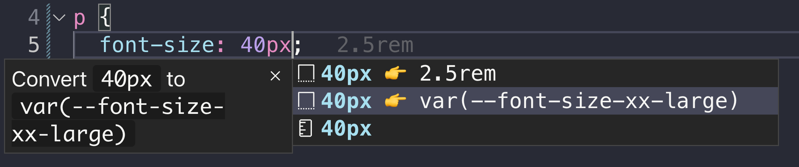

# Tools

## AI Assistance and MCP Server (beta)

**NB:** This feature is experimental and may change in the future. Please give us feedback on your experience with it!

If your AI coding agent supports the Model Context Protocol (MCP), you have two options:

1. **Use the hosted MCP server** at `https://eufemia-mcp.eufemia.workers.dev/mcp` — no installation needed, always serves the latest released docs.
2. **Run a local MCP server** that exposes the packaged documentation from `/docs` — useful for offline / air-gapped work, and pinned to the exact `@dnb/eufemia` version installed in your project (so the docs the AI sees match the components you actually consume).

### Hosted MCP server

Point your MCP-aware client at the public Streamable HTTP endpoint:

```
https://eufemia-mcp.eufemia.workers.dev/mcp
```

It is hosted on Cloudflare Workers, supports the modern Streamable HTTP transport, and serves the same documentation tools (`docs_entry`, `docs_search`, `component_find`, etc.) as the local server below. A health endpoint is available at `https://eufemia-mcp.eufemia.workers.dev/healthz`.

#### Example: Claude CLI / raicode CLI

```bash
claude mcp add --transport http eufemia https://eufemia-mcp.eufemia.workers.dev/mcp
# or
raicode mcp add --transport http eufemia https://eufemia-mcp.eufemia.workers.dev/mcp
```

### Local MCP server (pinned to your installed Eufemia version)

Run the local MCP server when you want the docs the AI sees to match the exact `@dnb/eufemia` version you have installed — for example to avoid suggestions that reference components or props from a newer release than your project consumes — or when the hosted Worker is unreachable (offline / air-gapped environments).

But first, make sure you have installed `@dnb/eufemia` and `@modelcontextprotocol/sdk` in your project:

```bash
npm install @dnb/eufemia @modelcontextprotocol/sdk
# or
yarn add @dnb/eufemia @modelcontextprotocol/sdk
# or
pnpm add @dnb/eufemia @modelcontextprotocol/sdk
```

Run the server from your project (where `@dnb/eufemia` is installed):

### Example MCP config (e.g. `.vscode/mcp.json`):

```json
{
  "servers": {
    "eufemia": {
      "command": "node",
      "args": [
        "${workspaceFolder}/node_modules/@dnb/eufemia/mcp/mcp-docs-server.js"
      ]
    }
  }
}
```

### Using Claude CLI with MCP:

```bash
claude mcp add --transport stdio eufemia -- node node_modules/@dnb/eufemia/mcp/mcp-docs-server.js
```

### Using raicode CLI with MCP (using Claude):

```bash
raicode mcp add --transport stdio eufemia -- node node_modules/@dnb/eufemia/mcp/mcp-docs-server.js
```

### How to use

- The MCP server helps AI apply Eufemia patterns more accurately in code, but results can still be imperfect. So always review the output carefully!
- The MCP server provides documentation context only; it does not execute code or access the network.
- Ask your AI tool to search or summarize Eufemia docs, e.g. "Find the spacing system rules in Eufemia."
- If the server fails to start, confirm `@dnb/eufemia` is installed and the path points to `node_modules/@dnb/eufemia/mcp/mcp-docs-server.js`.

## Code Editor Extensions

### The Visual Studio Code Extension

It supports:

- plain `px` to `rem` conversion.
- annotation for `px` and `rem` equivalent values.
- auto completion for the [spacing system](/uilib/usage/layout/spacing/).
- auto completion for [`font-size`](/uilib/typography/font-size/) and [`line-height`](/uilib/typography/line-height/).

Install the [VSCode Extension](https://marketplace.visualstudio.com/items?itemName=dnbexperience.vscode-eufemia) or view the
[source code](https://github.com/dnbexperience/vscode-eufemia).

#### Screenshots

1. Spacing System example



2. Equivalent to `px` or `rem` value example



3. `font-size` example



## Lint Plugins

Eufemia ships lint plugins as part of `@dnb/eufemia`, so you can import them directly from the main package.

Install `eslint` and/or `stylelint` in your application if you do not already use them.

### ESLint

Use the recommended flat config preset:

```js
import eufemiaEslint from '@dnb/eufemia/plugins/eslint.js'

export default [eufemiaEslint.recommended]
```

If you need full control, register the plugin and configure the rules yourself:

```js
import eufemiaEslint from '@dnb/eufemia/plugins/eslint.js'

export default [
  {
    plugins: {
      eufemia: eufemiaEslint,
    },
    rules: {
      // All rules
      ...eufemiaEslint.recommended.rules,

      // Or specific rules
      'eufemia/no-deprecated-color-variables': 'error',
    },
  },
]
```

### Stylelint

Use the recommended preset to enable all rules:

```js
import eufemiaStylelint from '@dnb/eufemia/plugins/stylelint.js'

export default eufemiaStylelint.recommended
```

If you need full control, register individual plugins and configure the rules yourself:

```js
import eufemiaStylelint from '@dnb/eufemia/plugins/stylelint.js'

export default {
  plugins: [eufemiaStylelint],
  rules: {
    'eufemia/no-deprecated-color-variables': true,
    'eufemia/token-name-policy': [true, { themePrefixes: { ui: 'dnb' } }],
  },
}
```

Available rules:

- **`eufemia/no-deprecated-color-variables`** — Warns when deprecated `--color-*` CSS variables are used. Suggests design tokens instead.
- **`eufemia/token-name-policy`** — Validates `--token-*` naming conventions: prefix, category, color semantics, theme prefixes, cross-brand parity, and more. Accepts a `themePrefixes` option to map brand names to their CSS variable prefixes.

For SCSS files, configure Stylelint with [postcss-scss](https://www.npmjs.com/package/postcss-scss) as the custom syntax.

### PostCSS (Style Isolation)

If you use the [style isolation](/uilib/usage/customisation/styling/style-isolation/) PostCSS plugin, deprecation warnings for `--color-*` variables are enabled by default at build time:

```js
import styleScopePlugin from '@dnb/eufemia/plugins/postcss-isolated-style-scope.js'

export default {
  plugins: [styleScopePlugin()],
}
```

To disable the warnings, set `warnOnDeprecatedColorVariables: false`:

```js
export default {
  plugins: [styleScopePlugin({ warnOnDeprecatedColorVariables: false })],
}
```

Both plugins ship with one rule: `no-deprecated-color-variables`. It reports deprecated `--color-*` CSS variables and guides towards design tokens instead.
