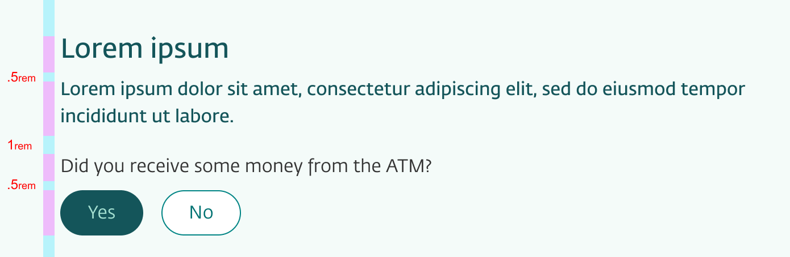

import SpacingTable from 'Pages/uilib/usage/layout/spacing-table.md'

# Spacing

## Spatial System

Eufemia has a [Spatial System](/quickguide-designer/spatial-system) with a grid of **8px** (0.5rem). This is simply a guide grid which helps with making design decisions about the sizes of components, elements, margins, paddings etc.



Also have a look at the designers example guide on [using Eufemias spatial system for layout](!/quickguide-designer/inspiration#using-eufemias-spatial-system-for-layout).

## Spacing Helpers

Spacing follows a specific pattern:

<SpacingTable />

## Components and Spacing

Also, have a look at the [Space](/uilib/components/space) component and the fact that every component supports [spacing out of the box](/uilib/components/space#components-and-spacing).

```jsx
<Button top="small" />
<Button right="large x-small medium" />
<Button space={{ top='small', right: 'large x-small medium' }} />
```

### CSS Custom Property

```css
margin-top: calc(var(--spacing-large) + var(--spacing-small));
```

### The Space component and Space Components (Emotion)

```js
import { Space } from 'dnb-ui-lib/components'

// A div with a margin-top of 2.5rem
<Space top="large x-small">
  ...
</Space>

// With Styled Components
const Custom = styled(Space)`
  /* additional css */
`
<Custom top="large x-small">
  ...
</Custom>
```

## Using a Spacing helper

The **SpacingHelper** can be used for all kinds of systems.
The idea is, You send in `createStyleObject({ top: 'large' })` and will get `{ marginTop: 2rem }` in return.

### Styled Components (Emotion)

```js
import { SpacingHelper } from 'dnb-ui-lib/shared'

// With Styled Components
const Spacing = styled.div(SpacingHelper)

// A div with a margin-top of 2rem
<Spacing top="large">
  ...
</Spacing>
```
