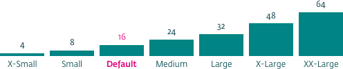
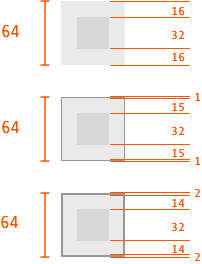

# Spatial system

### Contents

1. First a little about S P A C E
2. Principles
3. Types of Spacing

#### A system for layout and typography

The Spatial System consists of various spacing devices for positioning and layout of interface elements. These include: margins, paddings, grids, spacing blocks.

The DNB SS (for web) sits on a base 8 x 8 pixel grid.
8px units are ideal when dealing with pixel based interfaces as many common metrics consist of multiples of 8 allowing for consistency between typographic rules and interface layout.

### First a little about S P A C E

Everything rendered on a display takes up space. Whats left is space. The position of an element takes up space. The size and margins of an element takes up space. Line thickness, fills, block elements (such as icons, images etc.), take up space. An element can be said to have internal space and external space. Together these dictate the positions of their neighboring elements. Lets look at a simple example. An icon with a label.

1.  external space - around the icon
2.  internal space - within the icon

The external space is usually controlled by CSS, whereas the internal space needs to be carefully crafted in graphics applications.

### Why have a spatial system?

<!-- Everything in an interface affects the position of everything else. Without a system to dictate how things should be positioned in relation to other things chaos and poor user experience will ensue. -->

Space affects consistency, usability, readability and ultimately user experience.

A good spatial system takes some of the guesswork out of layout decisions for designers and developers.

## Principles

1.  Be consistent - use the spatial system for both layout and typography
2.  Keep it simple - avoid adding more block sizes or 'in-between' sizes
3.  Abstract the spacing - set spacing rules at an abstract level to allow for scaleability and future changes across whole systems

### Spacing Blocks

Interfaces are laid out and affected by blocks of space. Margins, paddings, insets, lines etc., set rules for how they relate to neighboring elements.

Using our 8px base we can establish a limited number of standard blocks with which to build with. Thus, design decisions become easier and less arbitrary.

Keep the names of the spacing blocks simple and generic. Small, Medium, Large, X-Large etc.

|                                                   | Name     | Pixels | Ems  |
| ------------------------------------------------- | -------- | ------ | ---- |
|  | xx-large | 64     | 4    |
|    | x-large  | 48     | 3    |
|      | large    | 32     | 2    |
|          | medium   | 24     | 1.5  |
|        | default  | 16     | 1    |
|          | small    | 8      | 0.5  |
|      | x-Small  | 4      | 0.25 |

### Design Software View Vs. Browser View

When laying out text content in a design app such as Sketch or Figma, it is easy to position the text on any pixel so that the design view looks perfect. However when building a UI in HTML and CSS, there are a number of properties which make this less straight forward. CSS's box model and font's baseline and cap heights have troublesome properties which make it difficult at times to stick to the baseline grids which the design is based on.

Therefore, there may sometimes be small discrepancies between the design file view and the coded in-browser view. These should be rectified in the browser - if every element and component has applied the typographic rules, they should align perfectly.

In the image above the heading with the yellow background is how the H1 is rendered in the browser, the right side shows the H1 bounding box in Sketch. Both are set with font size 32px and line height 40px.

See section - LINK: Typographic and Spatial System which addresses the relationship between type and component layout in UI's. It also explains how to normalize the properties that can often cause problems.

So, you don't need to be pixel perfect regarding vertical layout in your design application as the coded spacing will take care of accurate layout. However, to ensure that the finished design viewed in the browser matches your design layout, use the 8px base grid.

---

### Spatial System pointers

Use an non-linear scale to reduce the number of steps or options. For example, our scale doesn't simply start at 4 and double each step (4, 8, 16, 32, 64 ...). It doubles sometimes, other times it just increases by our base unit - 8 (4, 8, 16...then add 8...then add 8, then add 16...). So the steps are limited but give us enough to build our interfaces with.

If an element has an awkward size then try to make up for this by removing or adding space (See 'Borders & Lines').

## Types of spacing:

1.  margins
2.  padding
3.  z-index
4.  extents (wide display empty space)
5.  space within elements
6.  typography - margins and line-height (problems of cap-height and baseline )
7.  stacking or blocking
8.  inline
9.  dealing with borders
10. how we space things - positioning in CSS - relative, absolute, t,r,b,l

### 1. Margins

Margin refers to the space **outside or around** an object.
Use margins to create space between elements. Objects which allow interaction by touch should have enough margin around them that users don't accidentally hit the wrong object. Small margins can be used to indicate relationship between objects, large margins to indicate otherwise (Link to Gestalt principles of proximity (https://www.interaction-design.org/literature/topics/gestalt-principles)).

Set margins based on one or more spatial blocks.
margins do not have to be equal on all sides of and object. Margins between related objects can be reduced to position closer together.

The toggle switch and the ? button above have their own margin properties, but when placed next to each other we reduce their margins by half.

### 2. Padding

Padding refers to the space **within** an object.
Padding can be used to 'inflate' an objects bounding or 'hit' area\* or make it larger without scaling it's internal parts.

\*_Margins can also be used for this purpose, or a combination of both_

### 3. Z-index

Z-index spacing refers to space along the z-axis of an interface. It is not used much, except when styling shadows perhaps indicating that an object moves closer/further from/to the user. Another use is to indicate when objects are disabled by adding opacity and making them look like the are less prominent.

### 4. Extents

Extents refers to the amount of space available on displays and how much of it the content should take up. Ideal line length at default text-size (16px) is about 11-12 words. On large displays this can create vast areas of white space on the sides while still requiring the user to scroll. Use breakpoints to decide if multiple columns of content is a better way to present the content. Or simply increase font sizes. See example (**LINK**) pages where the body font-size is set in increments of 12px, 14px, 16px, 18px, 24px.

### 5. Space within elements

This relates to the amount of inner space an objects has. It has similarities to padding but also deals with small intricate cavities especially in graphic elements such as icons. When icons are resized down they sometimes loose some of their details and legibility.

IMG > detail showing | loss of detail

### 6. Typography

Typographic rules are intrinsically linked to the spatial system.

They are built on the same units of measurement (multiples of 8), however, aligning type to the baseline grid is not as straightforward as setting font sizes to multiples of 8.

The DNB type scale should be limited to **12px, 14px, 16px, 18px, 24px, 32px**. Larger sizes can be used but must follow the sizing and spacing rules.

For design applications, align elements to the 8px grid (see example below):

IMG add image of aligning things to the grid

For those familiar with CSS, we establish typographic rules in the following way:

1.  Set a body size for the interface. The default size for a browser is 100%

    `body { font-size: 100%; }`

    This will set the default size for paragraph text to **16px**

2.  Set font styles on paragraphs, headers, buttons etc. (basically everything) in the following manner:

    - font sizes should be set with **em**
    - line-heights should be set with **rem**
    - margin-**bottom** should be set with **rem**

    Use a calculator to calculate the **rem** and **em**.
    Alternatively, refer to these test pages which show various font sizes embedded in various body font sizes.
    Here is a good one: http://pxtoem.com/

### 7. Stacking / blocking

Stacking refers to the layout method whereby objects, elements, components are positioned on top of one another. It is a very basic but stable way to build.
Paragraphs are naturally stacked on top of one another. Space below each paragraph is used to indicate the beginning of a new paragraph.

We can also apply Gestalt proximity principals to vertical positioning. Refer to the illustrations below:

### 8. Inline

Inline spacing is similar to Stacking/Blocking but on the horizontal axis.

### 9. Dealing with Borders and lines

In order to maintain the baseline grid, elements which have borders should have their border thickness removed from the internal padding.

#### No internal padding?

For example a border on an image? Then remove the border thickness from the height of the image.

A single pixel equates to about 0.0625em ( 1/16 ), therefore if an element has padding of 1em (~16px) and a border of thickness 1px, we remove the border thickness from the padding:

Border = 0.0625em
Padding = 1em - 0.0625em = 0.9375em

For a 2px thick border we set the padding to be:

Padding = 1em - 0.125em = 0.875em

The bordered element will now sit nicely on the baseline grid.

### Horizontal lines and divider Lines

The same process should be applied in dealing with divider lines.
Horizontal rules and other dividing mechanisms usually have some margin or padding around them. Remove the lines thickness from the padding or margin (above or below), to maintain the baseline grid.

See example pages: **ADD LINK TO PAGES**

### 10. How we space things

<!-- Padding and vertical margins : .......

So, how do we establish a system for ALL probable combinations of elements in a GUI?

Answer: We provide a set of spacing units and a **guide** for how the spacing should be applied.

The spatial system doesn’t care what elements are in the design guide. It doesn’t care how they look or feel.

The SS is a rigid set of ’space-blocks’ akin to the leading slugs in a typesetters frame.
Rules dictate which slugs are placed adjacent to which blocks. -->

<!-- ### Grids

Space and grid are two different things. A grid is a component which _uses_ space.

### KISS

In order for a spatial system to be adopted it needs to be very simple. Deviations from the strict rules should be allowed for edge cases but their consequences must be discussed and agreed upon because we never know... -->

### Process

<!--By relating our base grid for elements and components to the typographic sizing system, we can maintain visual consistency between type and layout.-->

_Designers:_
Set up an 8px x 8px underlay for all interface design work. When positioning elements, have them 'snap' to this grid:

When a designer designs a component they must add the spatial rules to it before handing to developer. One way to do this is to include the 8px base grid as a background so that spacing can be counted easily.

Developer should cross check it with the design before releasing. If any browser compliant problems cannot be resolved\* so that the component looks right in the browser then the designer should be informed and a common solution should be found. Only then can the component be committed to the design guide 'stage'.

By 'resolved' we mean that a serious attempt has been made to make it look and feel according to the design. frontend developers usually have a good grasp of the shortcomings and workarounds involved in making browsers display UI's correctly.

<!--
# A detailed example of Spatial system with typographic rules.

Here is a common view of a web form designed for viewing on a wide display (large tablet/desktop).

-->
