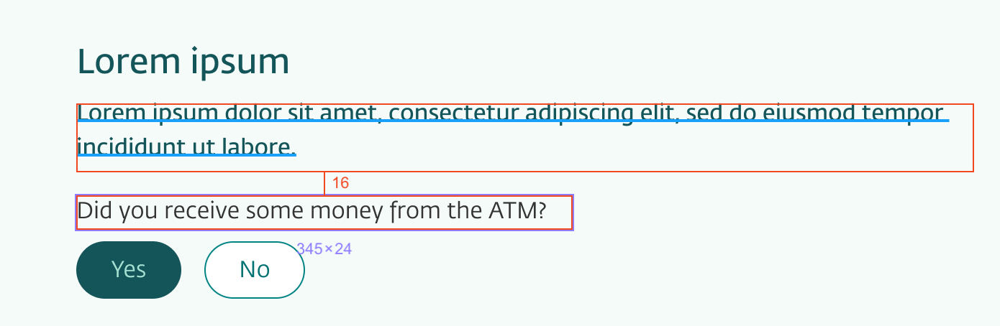

<Intro>

# UX handover

UX Designers at DNB are using Figma. Figma files can be shared and viewed online.

To get the details and properties about the layout, styles and the used components, you can inspect the file.

1. First, select and area by one click.
2. Second, hover on the next by areas to se the distance.

Remember, everything should be in the **8px grid/spacing** (0.5rem) - even it the designer sometimes are one or two pixels of, you now know what it should be.

</Intro>

---

[Next - Eufemia for Developers](/uilib/intro/04-eufemia-for-developers?fullscreen)
