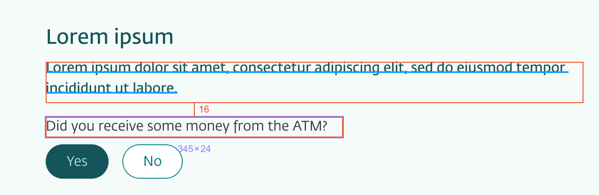

<Intro>

# UX handover

UX Designers at DNB are using Figma. Figma files can be shared and viewed online.

To get the details and properties about the layout, styles and the used components, you can inspect the file both for colors, typography, spacing and component usage.

## Spacing

Remember, everything should be in the **8px grid** (0.5rem) spacing - even it the designer sometimes are one or two pixels of, you now know what it should be.

## Handover

1. First, select and area by one click.
2. Second, hover on the next by areas to se the distance.

<IntroFooter href="/uilib/intro/04-eufemia-for-developers" text="Next - Eufemia for Developers" />

</Intro>
