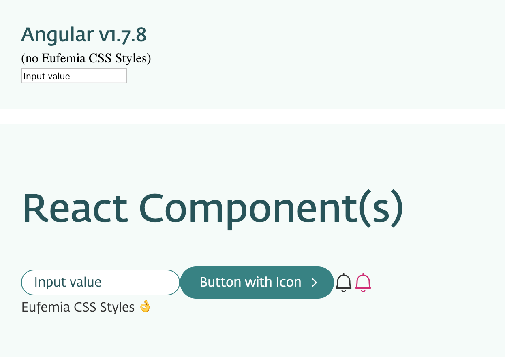

# DNB UI Library - Angular v1 Example

## How to run this Example App

1. Make sure You have installed the dependencies `yarn install`.
1. If You run this app inside the mono repo Eufemia, then make sure You build the `dnb-ui-lib` first. To do so, go to the `dnb-ui-lib` directory and run `yarn build`. This is because we consume the package content directly like: import `dnb-ui-lib/style` and not from the `src` folder, like: `dnb-ui-lib/src/style`.
1. Now You can run `yarn start` inside this Example App.
